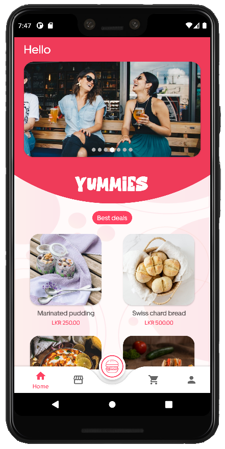
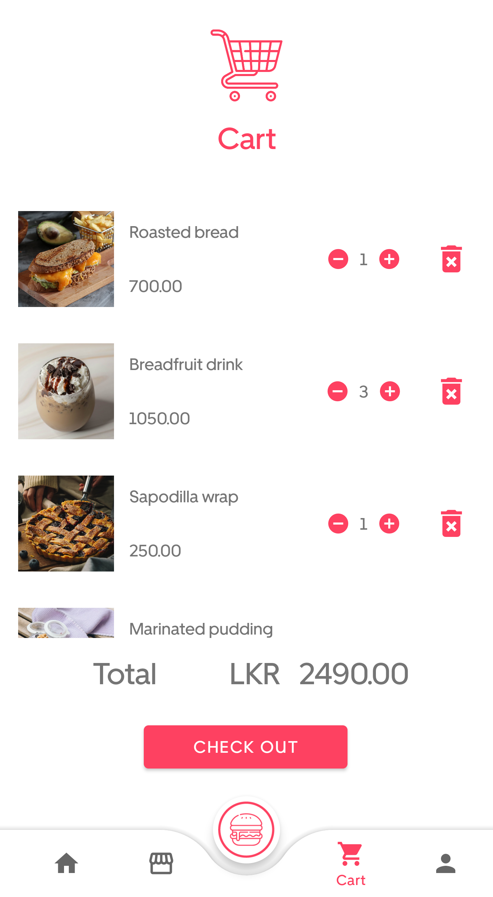

       
    

 

    
    

 

# Application purpose

- This App was developed for customers to order their food items from different restaurants in a single place. This App’s database has restaurants and their food menus. So the customers can browse each of their favourite restaurants and order their favourite foods through this Application.

 

# How to use

- When the app launches it will redirect you to the home page.

- This will show you some random best deals on food items from different restaurants. You can scroll down this list, pick any items you are interested in, and add them to your cart. When you click any item on this list will pop up a dialogue box.

- In that dialogue box, you can change the amount that you want and the total price will update according to your amount. After that, you can click on add to cart button. Then the food item will add to your cart.

- If you want to select food items from any specific restaurant, You can also do that. You just only need to go to the restaurant tab through the bottom navigation menu bar.

- Here you can see a list of restaurants in your area. If you click on a restaurant you can see its food menu. Then you can pick any food item. It will redirect you to another page. There you can see details of your picked item. Give the amount you want and click on add to cart button. It will add to your cart.

- After adding items to your cart you have to go to the cart tab. There you cant see all the items you added. If you want to change the amount or remove any item you can also do it here.

- After doing any changes you can click on the checkout button. If you are logged in to your account your payment will be successful.

- Otherwise, you have to log into your account with valid credentials. If you don't have an account you can create one by clicking the register button. There you have to provide your details to create an account. Then sign in and go back to your cart and try to checkout. Payment should be successful.

- If you are logged into your account you can see your order history on the dashboard tab.

 

# UI/UX

    
    
    
      
    
    
    
    

